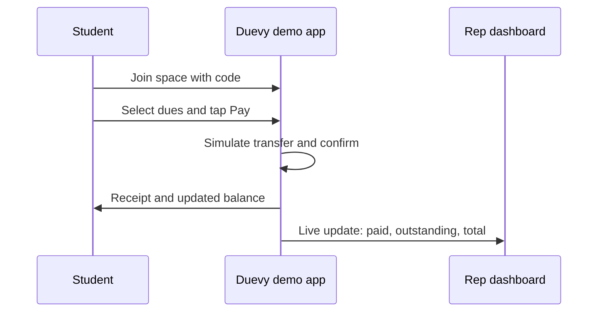
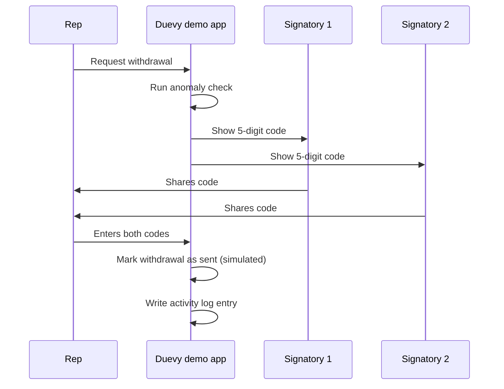

# Duevy Hackathon Demo: Product Documentation

> **Pay your dues. Simply.**

Duevy is a platform where Nigerian students pay departmental dues, handouts and levies in one transfer, and where course reps collect, track and withdraw that money with a full paper trail. This document describes every feature of the hackathon demo, what it does, and why it is there.

**Demo build** | **Simulated payments** | **3 build tracks**

**Tag legend:**

- `MVP`: in the real product now
- `DEFERRED`: planned after the pilot, built here for the demo
- `WINNING`: new, added to stand out at the hackathon

## Contents

- [Overview](#overview)
- [Users and roles](#users-and-roles)
- [Architecture](#architecture)
- [Core flows](#core-flows)
- [Track 1: Student experience](#track-1-student-experience)
- [Track 2: Rep and money](#track-2-rep-and-money)
- [Track 3: Admin, trust and platform](#track-3-admin-trust-and-platform)
- [Fee model](#fee-model)
- [Simulated data](#simulated-data)
- [Demo mode](#demo-mode)
- [The 3-minute demo script](#the-3-minute-demo-script)
- [Build priorities](#build-priorities)
- [Honest limits](#honest-limits)

---

## Overview

### The problem

In most Nigerian tertiary institutions, a course rep collects money through a WhatsApp broadcast, a personal bank account, screenshots of transfer receipts and a Google Form. There is no single record of who paid, the rep's personal account mixes with class money, students cannot verify where their money went, and one dishonest or careless rep can wipe out a whole class's funds.

### The solution

Duevy replaces that chain with one system. A rep creates a **space** for a department, class or association and adds **dues** to it. Students join with a code, tick the dues they owe and pay in a single transfer. The rep sees payments arrive live and withdraws to their own bank account, and every movement of money is recorded in an audit trail that students can inspect.

### What this demo is

This build is a working demonstration for a hackathon. All data is **simulated**: students, payments, bank transfers, KYC checks and messages are seeded or generated inside the app, with no backend, database or payment provider behind it. The interface, flows and permissions behave like the real product, so the whole story can be shown reliably in minutes.

> **Design goal:** make the trust problem visible. Every feature either speeds up collection or proves that the money is safe.

---

## Users and roles

Roles are additive. A person signs up as a student, and gains rep permissions through an `isRep` flag rather than a separate account. Both use the same `/dashboard`; super admins use `/admin`.

| Role        | Who they are                                   | What they can do                                                                                     |
| ----------- | ---------------------------------------------- | ---------------------------------------------------------------------------------------------------- |
| Student     | Any coursemate in a space                      | Join spaces, pay dues, view receipts and history, request refunds, vote in polls, use the assistant. |
| Rep         | Course rep or class treasurer who owns a space | Create spaces and dues, view live collections, withdraw money, invite co-reps, run polls.            |
| Co-rep      | Treasurer, secretary or PRO invited by a rep   | Role-based access to a space. Treasurers can act as signatories on withdrawals.                      |
| Super admin | Duevy operator                                 | Approve reps, oversee all spaces and transactions, handle disputes, manage schools.                  |
| Institution | A school portal (through the API)              | Read dues data for its own students with an API key.                                                 |

---

## Architecture

The demo is a front-end-only build. Everything runs in the browser on simulated data, so it works without a server, a database or a bank.

| Layer              | Choice                                          | Demo note                                                                   |
| ------------------ | ----------------------------------------------- | --------------------------------------------------------------------------- |
| Frontend           | Next.js (App Router), TypeScript                | One shared dashboard, separate `/admin` area.                               |
| Simulated data     | JSON seed files in in-memory state              | Loads on start. A reset button restores it. Nothing is saved.               |
| Simulated payments | In-app payment simulator                        | Confirms transfers on a button press or after a short delay.                |
| Simulated KYC      | In-app verifier                                 | Approves any test BVN. No real identity data is used.                       |
| AI features        | Pre-written responses, optional live model call | Nudges, assistant and anomaly explanations always have a scripted fallback. |
| Hosting            | Vercel                                          | Static deploy, shareable link for judges.                                   |

---

## Core flows

### Paying dues

The heart of the product: a student pays several dues in one transfer, and the rep's dashboard updates immediately.

### Withdrawing with two signatories

No single person can move class money. A withdrawal needs two independent approvals.

---

## Track 1: Student experience

Everything a student sees. The goal is that paying dues takes under a minute and feels safe.

#### Signup, login and join by code

**Tag:** `MVP`

Students create an account first, then join a space using a code from their rep, then pay. Payments are never anonymous.

- **How it works:** Sign up with name, email and phone. Enter a space code (or scan a QR). The rep's space appears with its list of dues.
- **Why it matters:** An account ties every payment to a real student, which makes receipts, history and refunds possible.
- **In the demo:** Fully working, plus QR join for fast live demos.

#### Multi-due cart and single-transfer payment

**Tag:** `MVP`

A student ticks every due they owe (handout, exam levy, association due) and pays the combined total in one transfer.

- **How it works:** Selected dues are summed with the student fee. The app creates a simulated payment for that exact amount and confirms it after a short delay or a button press.
- **Why it matters:** One transfer replaces five separate ones, five screenshots and five rounds of chasing.
- **In the demo:** Simulated transfer with a live confirmation animation.

#### Receipts and payment history

**Tag:** `MVP`

Every payment produces a receipt with a reference, the dues covered and the time paid. History lists them all.

- **How it works:** Receipts are generated when a simulated payment is confirmed and can be viewed or shared.
- **Why it matters:** Students get proof of payment that a rep cannot dispute, and it ends the screenshot culture.
- **In the demo:** Working, with a shareable receipt page.

#### Instalment and split payments

**Tag:** `DEFERRED`

Pay a large due in parts, or split one payment between coursemates.

- **How it works:** The rep allows instalments on a due. The student picks a plan (for example three payments). A progress bar shows paid versus remaining, and each part is its own receipt. Split mode gives a group one link with shares per person.
- **Why it matters:** Many students cannot pay a full levy at once. Instalments increase collection rates and reduce defaulters.
- **In the demo:** Clickable end to end with the progress bar and part receipts.

#### Saved cards

**Tag:** `DEFERRED`

Store a card securely so repeat payments are one tap.

- **How it works:** After a first card payment the student can save a tokenised card. The app stores only a token and the last four digits, never the card number.
- **Why it matters:** Faster repayment on instalments and recurring dues.
- **In the demo:** Simulated card tokens with masked display.

#### Student wallet

**Tag:** `DEFERRED`

A balance the student tops up and spends on dues.

- **How it works:** Top up by transfer, then choose Pay from wallet at checkout. Refunds land back in the wallet.
- **Why it matters:** Students can save small amounts over the semester so a big levy is not a shock.
- **In the demo:** Working balance with top up, spend and refund entries.

#### Self-service refunds

**Tag:** `DEFERRED`

A student requests their money back for a cancelled or wrongly paid due.

- **How it works:** Pick the payment, give a reason, submit. The rep or admin approves, and the amount returns to the wallet with a receipt.
- **Why it matters:** Removes the awkward WhatsApp begging that happens today and creates a record of every reversal.
- **In the demo:** Full request and approval loop, feeding the dispute queue in Track 3.

#### Polls and paid voting

**Tag:** `DEFERRED`

Departmental polls, elections and award nights, with optional paid ballots.

- **How it works:** A rep creates a poll with candidates. Each student votes once, or buys extra votes for awards-style contests. Results update live and the ballot revenue goes to the space.
- **Why it matters:** It turns Duevy into the place where class life happens, not just where dues are paid, and it opens a second revenue stream.
- **In the demo:** One live poll with a results chart.

#### In-app assistant (English and Pidgin)

**Tag:** `DEFERRED`

A chat helper that answers student questions about their own account.

- **How it works:** The assistant reads the student's dues and payments and answers questions such as what do I owe, did my payment go through, and when is the deadline. It replies in Pidgin if asked.
- **Why it matters:** It cuts the flood of "did you get my money?" messages that reps get every week.
- **In the demo:** Live LLM chat limited to the student's seeded data.

#### WhatsApp channel

**Tag:** `DEFERRED`

Pay and check dues from a chat, since that is where students already are.

- **How it works:** A chat interface accepts messages like "balance" or "pay handout", returns a payment link and sends the receipt back in the thread.
- **Why it matters:** Meets students in the app they use all day, with no new habit to learn.
- **In the demo:** A simulated chat window styled like a messenger, wired to the same simulated data.

#### Referral programme

**Tag:** `DEFERRED`

Students who bring in a new space or coursemates earn fee credit.

- **How it works:** Each user gets a referral link. When a referred rep completes their first collection, the referrer's wallet is credited.
- **Why it matters:** Campus growth is the biggest challenge for a student product, and referrals pay for themselves.
- **In the demo:** Link, tracking and a credit event shown on the wallet.

#### USSD-style pay flow

**Tag:** `WINNING`

Pay dues from a basic phone with no data, using menu-driven codes.

- **How it works:** A phone-style simulator presents numbered menus: choose space, choose dues, confirm. It uses the same simulated payment logic.
- **Why it matters:** Shows real financial inclusion for students without smartphones or data. This speaks directly to fintech and inclusion judging criteria.
- **In the demo:** Simulated phone screen inside the app.

#### Smart payment reminders

**Tag:** `WINNING`

Automatic nudges before and after a due date.

- **How it works:** Notifications go out three days before, on the day and after the deadline, with a one-tap pay link.
- **Why it matters:** Collection rates rise when reminders are timely, and reps stop chasing manually.
- **In the demo:** In-app notification feed with a trigger button to show reminders instantly.

---

## Track 2: Rep and money

The rep's control room: create the space, watch collections, and move money safely.

#### Rep registration, approval and KYC gating

**Tag:** `MVP`

A rep signs up, is approved by a super admin, and lands in a dashboard with a KYC banner.

- **How it works:** Until KYC is complete the rep can explore, create a space and draft dues, but cannot collect. KYC uses BVN, date of birth and gender, checked by a simulated verifier. Students never do KYC.
- **Why it matters:** Money only flows to verified people, without adding friction for the students who make up most users.
- **In the demo:** Simulated BVN check that unlocks collection within seconds.

#### Spaces and dues

**Tag:** `MVP`

A space is a department, class or association. Dues live inside it.

- **How it works:** The rep names the space, gets a join code, and adds dues. Types: handout, departmental due, exam levy, lab manual, association due, departmental wear, trip fee, clearance, other. Each due has an amount, deadline and optional instalments.
- **Why it matters:** It structures money that is currently scattered across chats and notebooks.
- **In the demo:** Fully working, including all due types.

#### Live collections dashboard

**Tag:** `MVP`

See who has paid, who has not, and how much has come in, updating in real time.

- **How it works:** Totals, a payer list and an outstanding list update instantly each time a simulated payment is confirmed. Filters by due and by student.
- **Why it matters:** It replaces the spreadsheet and gives the rep an instant answer to "who is owing?".
- **In the demo:** The centrepiece screen. Seed data keeps payments trickling in so it never looks empty.

#### Withdrawals and fee calculation

**Tag:** `MVP`

The rep sends collected money to their own bank account.

- **How it works:** Enter an amount and destination. The fee shows before confirmation: ₦100 up to ₦50,000 and ₦200 above. The withdrawal is recorded in the activity history with a reference.
- **Why it matters:** Reps get their money quickly, and the fee is transparent.
- **In the demo:** Simulated bank transfer with a realistic status progression.

#### Two-signatory withdrawals ⭐

**Tag:** `WINNING`

Two people must each supply a 5-digit code before any withdrawal is released. This is the flagship feature of the demo.

- **How it works:** Each space has two signatories, for example the rep and the treasurer or a lecturer adviser. When a withdrawal is requested, each signatory receives a separate one-time code. The rep must enter both. If either is wrong or expired, nothing moves.
- **Why it matters:** Reps should not be able to withdraw class money "any how". This makes theft or mistakes require collusion and gives students a concrete reason to trust the system.
- **In the demo:** Live on stage: request a withdrawal, show both codes arriving, and block one with a wrong code.

#### Full co-rep team management

**Tag:** `DEFERRED`

Invite the whole class executive into a space with defined roles.

- **How it works:** Invite by email or link and assign a role such as treasurer, secretary or PRO. Each role has permissions: for example only treasurers can be signatories, while the PRO can post announcements and view reports.
- **Why it matters:** Class money is a team responsibility. Roles spread it out and give the two-signatory feature real people to work with.
- **In the demo:** Invite flow, role picker and permission-aware UI.

#### Dues advance (lending)

**Tag:** `DEFERRED`

Release up to about 80 percent of expected dues early, repaid from later collections. Inspired by the Schoolable model.

- **How it works:** Based on a space's collection history, Duevy offers an advance. Repayment is deducted automatically as students pay, so there is no separate repayment schedule to manage.
- **Why it matters:** Reps often need to buy materials or book venues before the money is in. An advance solves that without personal loans.
- **In the demo:** A calculator and offer screen with simulated repayment. It is shown as an idea, not a live lending product.

#### Discounted vendor marketplace

**Tag:** `DEFERRED`

Vendors sell handouts, class wear and manuals to a space at discounted prices, paid through the space.

- **How it works:** Approved vendors list products. A rep picks an item and attaches it as a due, so students pay through Duevy and the vendor is paid from the space.
- **Why it matters:** Bulk demand across many spaces gives students better prices and gives Duevy a revenue line.
- **In the demo:** Catalogue and attach-to-due flow with two seeded vendors.

#### AI defaulter nudges

**Tag:** `WINNING`

One click writes and sends personalised reminders to everyone who has not paid.

- **How it works:** The AI looks at each defaulter's amount owed, deadline and past behaviour, drafts a polite message in English or Pidgin, and suggests the best send time. The rep reviews and sends.
- **Why it matters:** It turns the most awkward part of being a rep into a single button and lifts collection rates.
- **In the demo:** Live generation on the seeded defaulters list.

#### Anomaly flags on withdrawals

**Tag:** `WINNING`

Suspicious withdrawals are paused and explained before any money moves.

- **How it works:** Rules check for unusually large amounts, odd hours, a new destination account, or withdrawing almost the entire balance. A flagged request goes to review and shows a plain-language reason.
- **Why it matters:** It adds a second layer of protection on top of the two signatories and shows fraud thinking that judges value.
- **In the demo:** A seeded suspicious request that gets blocked live.

#### Rep trust score

**Tag:** `WINNING`

A visible badge showing how reliably a rep runs their space.

- **How it works:** The score combines timely payouts, transparency page usage, dispute rate and student ratings. It shows on the space page and reduces friction for high-scoring reps.
- **Why it matters:** Students can judge a space at a glance, and reps are rewarded for behaving well.
- **In the demo:** Score card on each seeded space.

---

## Track 3: Admin, trust and platform

The back office and the trust layer that make everything else believable.

#### Super admin console

**Tag:** `MVP`

Approve reps and oversee every space and transaction.

- **How it works:** A separate `/admin` area lists pending reps, all spaces, and all transactions with search and filters.
- **Why it matters:** Human approval before a rep can collect is a key safeguard in the early product.
- **In the demo:** Approve a rep live and watch their dashboard unlock.

#### Audit log and permissions

**Tag:** `MVP`

Every important action is recorded with who, what and when.

- **How it works:** Logins, approvals, dues changes, withdrawals and role changes create log entries. Permissions are enforced in the interface for each role.
- **Why it matters:** It is the evidence trail that resolves disputes and supports the transparency features.
- **In the demo:** Searchable log viewer in the admin console.

#### Multi-institution rollout

**Tag:** `DEFERRED`

Support many universities from one platform.

- **How it works:** Every space belongs to a school. A switcher and per-school settings (name, faculties, departments, branding) keep data separate. The seed data is already organised by school.
- **Why it matters:** Launch starts at LAUTECH, but the product is meant to scale to every campus.
- **In the demo:** Three seeded schools with a working switcher.

#### Public institution API

**Tag:** `DEFERRED`

Let a school's own portal pull dues data straight from Duevy.

- **How it works:** A simulated API console shows how a school would use keys scoped to its own students. Sample requests return payment status by matric number from the seed data, and a docs page explains each one.
- **Why it matters:** Clearance and departmental checks become automatic, which makes Duevy useful to the school itself.
- **In the demo:** Key generation, a sample request and response, and an interactive docs page, all on seed data.

#### Refund and dispute queue

**Tag:** `DEFERRED`

A single place to handle refund requests and payment complaints.

- **How it works:** Requests from students land in a queue with the payment, reason and history attached. Admins or reps approve, reject or escalate, and each decision is logged.
- **Why it matters:** It gives students a fair route to fix mistakes instead of relying on goodwill.
- **In the demo:** Working queue fed by the student refund feature.

#### Public transparency page ⭐

**Tag:** `WINNING`

A shareable page for each space showing where the money is, with no login required.

- **How it works:** It displays total collected, total withdrawn, current balance and a list of withdrawals with purposes. Personal student details are hidden. Reps share the link in the class group.
- **Why it matters:** Transparency is the answer to distrust. Students can verify for themselves, which builds trust faster than any promise.
- **In the demo:** Open on a phone by scanning a QR from the dashboard.

#### Exportable audit report (PDF)

**Tag:** `WINNING`

A clean financial statement for the class, the HOD or the department.

- **How it works:** One click builds a PDF with collections by due, payer counts, withdrawals, fees and closing balance for a chosen period.
- **Why it matters:** Reps can hand it to staff at the end of the session, and it looks professional.
- **In the demo:** Generated instantly from seed data.

#### Seed data and demo mode

**Tag:** `WINNING`

A prepared world so every screen is full and every story is repeatable.

- **How it works:** Seed files create about 200 fake students, one department space, several dues, a history of payments and a few edge cases. A demo panel lets the presenter trigger payments, reset data and switch roles.
- **Why it matters:** Nothing is ever empty on stage, and nothing depends on live internet, a server or a real bank.
- **In the demo:** Loads on start, reset with one button.

---

## Fee model

The demo mirrors the current real fee structure so the numbers in the pitch are consistent.

| Who pays | When                    | Amount                                                                   |
| -------- | ----------------------- | ------------------------------------------------------------------------ |
| Student  | Each collection payment | 2% of the payment, capped at ₦250, including the payment provider's cut. |
| Rep      | Each withdrawal         | ₦100 up to ₦50,000; ₦200 above ₦50,000.                                  |
| Space    | Never                   | Receives the full face amount of every due.                              |

Example: a ₦5,000 handout costs the student ₦100 in fees (2%), so they pay ₦5,100 and the space receives exactly ₦5,000.

---

## Simulated data

There is no database. All content comes from seed files that load into the app when it starts. Changes made during the demo (a payment, a withdrawal, an approval) live in memory and disappear on refresh or reset.

| Dataset              | What it contains                                                      | Seeded amount                   |
| -------------------- | --------------------------------------------------------------------- | ------------------------------- |
| Schools              | Names, faculties, departments                                         | 3 schools                       |
| Students             | Name, matric number, phone, join status                               | About 200 in one department     |
| Reps and co-reps     | Roles, KYC status, signatory flag                                     | 1 rep, 2 co-reps, 1 pending rep |
| Spaces               | Department, class and association spaces with join codes              | 3 spaces                        |
| Dues                 | One or more of each due type, amounts, deadlines, instalment settings | 8 to 10 dues                    |
| Payments             | Past payments, receipts, partial instalments, a few unpaid students   | Several hundred entries         |
| Withdrawals          | Completed payouts plus one deliberately suspicious request            | 5 entries                       |
| Refunds and disputes | Pending and resolved requests                                         | 4 entries                       |
| Polls                | One live poll with candidates and votes                               | 1 poll                          |
| Vendors              | Marketplace catalogue for handouts and class wear                     | 2 vendors                       |
| Activity log         | Logins, approvals, dues changes and withdrawals                       | Grows as the demo runs          |

> Every name, number and transaction is invented. No real BVN, bank detail or student record is used anywhere in the demo.

---

## Demo mode

Because the whole demo runs on simulated data, four behaviours define it.

- **Payments are simulated.** A payment is confirmed on a button press or after a short delay.
- **KYC is instant.** Any test BVN passes.
- **Messaging is on-screen.** Codes, reminders, WhatsApp and USSD show in in-app windows rather than real SMS.
- **Data is seeded.** A department of about 200 students with payment history, defaulters and one suspicious withdrawal.

---

## The 3-minute demo script

This is a sequence, so it is numbered. Rehearse it until the timing is second nature.

1. **The problem (20 seconds).** Show a messy WhatsApp collection thread. Say: no record, personal accounts, no trust.
2. **Rep creates a due (20 seconds).** Open the rep dashboard and add a levy with instalments allowed.
3. **Students pay (40 seconds).** Pay from a phone: join by QR, pick two dues, pay. Show the receipt.
4. **Live update (20 seconds).** The rep dashboard ticks up in real time. Trigger a burst of seeded payments.
5. **Nudge defaulters (20 seconds).** Click once, show the personalised Pidgin reminders.
6. **The block (40 seconds).** Request a suspicious withdrawal. Anomaly flag fires. Show the two-signatory codes, enter one wrong, and watch it refuse.
7. **Trust and roadmap (20 seconds).** Scan the transparency page QR, then flash the roadmap of instalments, wallet, marketplace and API.

---

## Build priorities

Judges reward a smooth story over a long feature list. Build in these tiers.

| Tier             | Features                                                                                        | Standard                               |
| ---------------- | ----------------------------------------------------------------------------------------------- | -------------------------------------- |
| Polished         | Payment flow, live rep dashboard, two-signatory withdrawal, anomaly flag, transparency page     | Flawless, animated, rehearsed.         |
| Clickable        | Instalments, wallet, refunds, polls, co-rep roles, AI nudges, PDF report, multi-school switcher | Works end to end on seeded data.       |
| Simulated screen | WhatsApp, USSD, institution API, lending, marketplace, referrals                                | Looks real, may be shallow underneath. |

### Suggested track split

- **Track 1, Student experience:** the payment flow and everything a student touches, including WhatsApp and USSD screens.
- **Track 2, Rep and money:** dashboard, withdrawals, two-signatory codes, nudges, anomaly checks, lending.
- **Track 3, Admin and trust:** seeded data, activity log, transparency page, PDF report, API console and docs.

---

## Honest limits

- No real money moves in this demo. Say so plainly when asked; judges respect it.
- Handling student funds in production requires regulatory steps (including licensing and registration) that a demo does not replace. Present this as a known part of the roadmap.
- Features tagged as deferred are built here to show direction. They are not commitments about the real launch scope.
- AI features use pre-written responses by default so the demo never depends on a network call.
